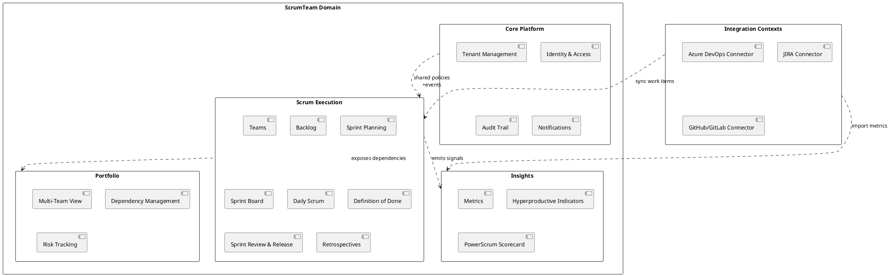

Architecture

Overview
This solution is a SaaS platform for managing Scrum teams. It uses CQRS
with Wolverine for the API layer and Marten for persistence on Postgres.
Domains are separated into their own projects under src/ and composed by
ScrumTeam.Server.

Core Stack
- .NET 10
- Wolverine (HTTP + CQRS)
- Marten (Document DB on PostgreSQL)
- xUnit (unit, integration, system tests)

Solution Layout
- ScrumTeam.Server: API host and composition root
- src/ScrumTeam.Teams: Teams domain (sample slice)
- test/ScrumTeam.UnitTests: unit tests
- test/ScrumTeam.IntegrationTests: integration tests
- test/ScrumTeam.SystemTests: system tests
- docs/: product and feature documentation

CQRS Conventions
- Commands use IDocumentSession and are handled via Wolverine endpoints.
- Queries use IQuerySession for read-only operations.
- Write handlers return explicit result records for APIs.

Multi-Tenancy
- Marten is configured for multi-tenant documents.
- Tenant id is derived from the X-Tenant-Id request header.
- A default tenant id is used when the header is absent.

Testing Strategy
- Unit tests cover domain logic and behavior.
- Integration tests validate persistence and API boundaries.
- System tests validate end-to-end scenarios.

Infrastructure Dependencies
- PostgreSQL for Marten storage.
- Optional integrations: Azure DevOps, JIRA, GitHub/GitLab.

C4 Model

```plantuml
@startuml
!include https://raw.githubusercontent.com/plantuml-stdlib/C4-PlantUML/master/C4_Container.puml

LAYOUT_WITH_LEGEND()

Person(scrumMaster, "Scrum Master", "Runs ceremonies and improves flow")
Person(productOwner, "Product Owner", "Owns backlog and priorities")
Person(developer, "Developer", "Builds and ships product")
Person(leader, "Leader", "Views portfolio health")

System_Boundary(platform, "ScrumTeam Platform") {
  Container(api, "ScrumTeam.Server", "Wolverine HTTP API", "CQRS endpoints and composition root")
  Container(teamsDomain, "ScrumTeam.Teams", ".NET class library", "Teams domain and endpoints")
  ContainerDb(marten, "Marten (PostgreSQL)", "Document DB", "Multi-tenant persistence")
}

System_Ext(azureDevOps, "Azure DevOps", "Work item system")
System_Ext(jira, "JIRA", "Work item system")
System_Ext(gitProviders, "GitHub/GitLab", "Source control and CI")

Rel(scrumMaster, api, "Manages team workflow", "HTTPS")
Rel(productOwner, api, "Plans and prioritizes", "HTTPS")
Rel(developer, api, "Updates work items", "HTTPS")
Rel(leader, api, "Views metrics", "HTTPS")

Rel(api, teamsDomain, "Loads domain slices")
Rel(api, marten, "Reads/Writes via IQuerySession/IDocumentSession", "Marten")

Rel(api, azureDevOps, "Syncs work items", "OAuth/API")
Rel(api, jira, "Syncs work items", "OAuth/API")
Rel(api, gitProviders, "Reads CI status", "OAuth/API")

@enduml
```

DDD Big Picture


