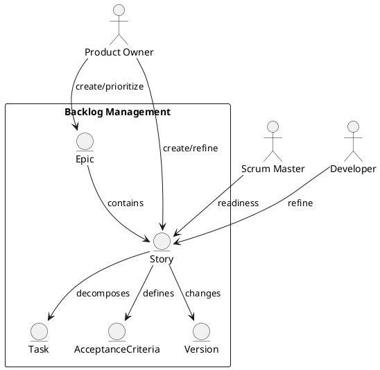

Feature 002: Product Backlog Management

Purpose
Enable teams to capture, refine, and prioritize work in a structured and
transparent product backlog.

Users
- Product Owners
- Scrum Masters
- Developers

User Stories
- As a Product Owner, I can create epics and user stories with priority.
- As a team, we can refine items and add acceptance criteria.
- As a Scrum Master, I can track refinement readiness.

Acceptance Criteria
- Backlog items support epics, stories, and tasks.
- Items have priority, size, and readiness status.
- Refinement changes are versioned and visible.

Metrics
- Backlog health (ready vs not ready)
- Aging items by priority

Integrations
- Optional sync of backlog items from Azure DevOps and JIRA.

Out of Scope
- Full requirements management tooling.

Diagram

