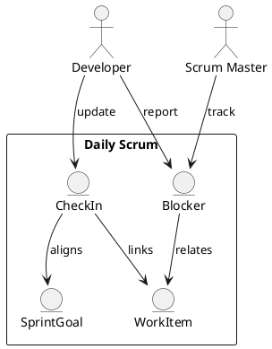

Feature 005: Daily Scrum Support

Purpose
Make the daily scrum focused, fast, and centered on progress toward the
sprint goal.

Users
- Scrum Masters
- Developers

User Stories
- As a developer, I can quickly update progress and blockers.
- As a Scrum Master, I can see unresolved blockers by age.
- As a team, we can align on the sprint goal daily.

Acceptance Criteria
- Daily check-in captures progress, blockers, and next steps.
- Blockers have owner and escalation path.
- Notes are linked to sprint items.

Metrics
- Blocker count and age
- Daily participation rate

Integrations
- Optional updates posted to Teams/Slack.

Out of Scope
- Full meeting scheduling.

Diagram

