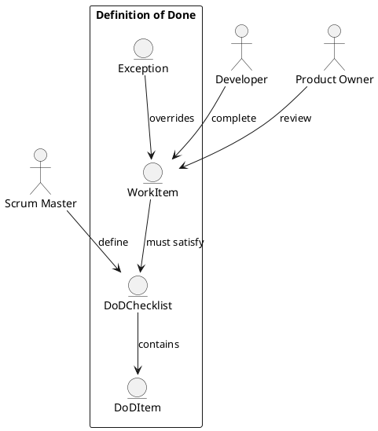

Feature 006: Definition of Done and Quality Gates

Purpose
Ensure consistent quality by making Definition of Done (DoD) explicit and
enforced within workflows.

Users
- Scrum Masters
- Developers
- Product Owners

User Stories
- As a Scrum Master, I can define DoD per team or product.
- As a developer, I can see required checks before completion.
- As a Product Owner, I can trust completed items meet agreed quality.

Acceptance Criteria
- DoD checklist can be configured and versioned.
- Items cannot be marked done unless DoD is satisfied.
- Exceptions require a reason and approval.

Metrics
- DoD compliance rate
- Exception count

Integrations
- Optional CI status checks from GitHub/GitLab/Azure DevOps.

Out of Scope
- Full test management suites.

Diagram

