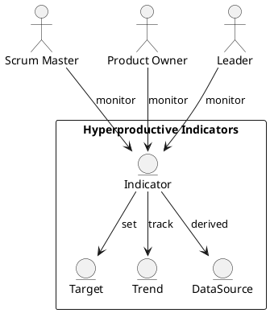

Feature 010: Hyperproductive Indicators

Purpose
Surface indicators aligned with Jeff Sutherland's research to help teams
pursue hyperproductive performance.

Users
- Scrum Masters
- Product Owners
- Leaders

User Stories
- As a Scrum Master, I can see indicators linked to hyperproductive teams.
- As a leader, I can track improvement over time.
- As a Product Owner, I can see where flow is blocked.

Acceptance Criteria
- Indicators are defined, visible, and explained in plain language.
- Teams can set targets and track trends.
- Indicators are based on measurable data from the platform.

Metrics
- Sprint goal success rate
- Flow efficiency
- Rework ratio

Integrations
- Optional import of historical data from existing tools.

Out of Scope
- Academic benchmarking services.

Diagram

