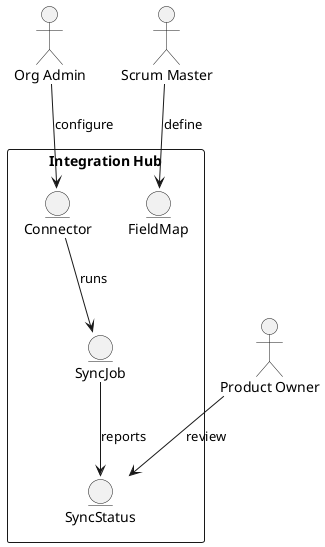

Feature 013: Integrations

Purpose
Connect with existing delivery platforms to avoid duplicate work and keep
teams aligned.

Users
- Scrum Masters
- Product Owners
- Developers
- Org admins

User Stories
- As an org admin, I can connect Azure DevOps and JIRA to sync work items.
- As a Scrum Master, I can map statuses and fields.
- As a Product Owner, I can keep reporting consistent across tools.

Acceptance Criteria
- OAuth or token-based connection for each platform.
- Field and status mapping is configurable.
- Sync status and errors are visible and actionable.

Metrics
- Sync success rate
- Sync latency

Integrations
- Azure DevOps
- JIRA
- GitHub/GitLab (optional)

Out of Scope
- Full migration services.

Diagram

