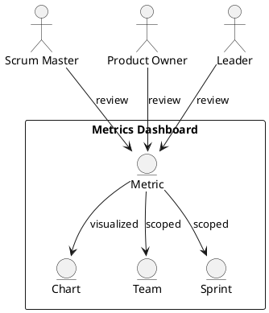

Feature 009: Metrics Dashboard

Purpose
Provide clear, non-vanity metrics that help teams understand flow and
predictability.

Users
- Scrum Masters
- Product Owners
- Leaders

User Stories
- As a Scrum Master, I can see velocity trends and throughput.
- As a Product Owner, I can see predictability and delivery confidence.
- As a leader, I can see portfolio-level health without disrupting teams.

Acceptance Criteria
- Dashboards show velocity, throughput, cycle time, and predictability.
- Metrics are contextual to team and sprint.
- Charts are exportable.

Metrics
- Velocity trend
- Cycle time distribution
- Predictability index

Integrations
- Optional metrics import from Azure DevOps and JIRA history.

Out of Scope
- Financial reporting.

Diagram

