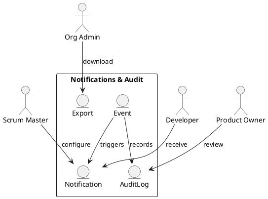

Feature 014: Notifications and Audit Trail

Purpose
Keep teams informed while preserving a clear history of decisions and
changes.

Users
- Scrum Masters
- Product Owners
- Developers
- Org admins

User Stories
- As a Scrum Master, I can configure reminders for ceremonies.
- As a Product Owner, I can see who changed backlog priorities.
- As an org admin, I can export audit logs for compliance.

Acceptance Criteria
- Notifications can be configured by event type.
- Audit trail records create/update/delete actions with actor and time.
- Audit logs are exportable.

Metrics
- Notification delivery rate
- Audit log volume

Integrations
- Email, Slack, Teams

Out of Scope
- Enterprise compliance certifications.

Diagram

