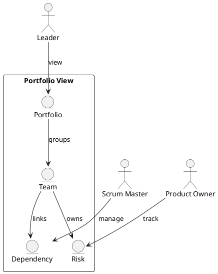

Feature 012: Portfolio and Multi-Team View

Purpose
Provide cross-team visibility for dependencies, risks, and outcomes
without disrupting team autonomy.

Users
- Leaders
- Scrum Masters
- Product Owners

User Stories
- As a leader, I can view multiple teams in one portfolio.
- As a Scrum Master, I can highlight cross-team dependencies.
- As a Product Owner, I can see risks to roadmap delivery.

Acceptance Criteria
- Portfolios group teams and products.
- Dependencies can be linked and tracked.
- Risks are visible with owner and status.

Metrics
- Dependency count and age
- Cross-team risk trend

Integrations
- Optional aggregation from Azure DevOps and JIRA projects.

Out of Scope
- Full program management tooling.

Diagram

