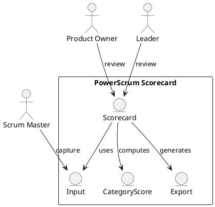

Feature 011: PowerScrum Scorecard

Purpose
Translate the PowerScrum Excel model into an interactive, auditable
scorecard inside the platform.

Users
- Scrum Masters
- Product Owners
- Leaders

User Stories
- As a Scrum Master, I can fill in PowerScrum inputs in the platform.
- As a leader, I can see scorecard trends over time.
- As a Product Owner, I can link scorecard outcomes to improvement actions.

Acceptance Criteria
- Scorecard fields match the PowerScrum model.
- Scoring is transparent and reproducible.
- Results can be exported to CSV.

Metrics
- Scorecard overall score
- Category-level scores

Integrations
- Optional import from existing PowerScrum spreadsheets.

Out of Scope
- Spreadsheet editing beyond import/export.

Diagram

