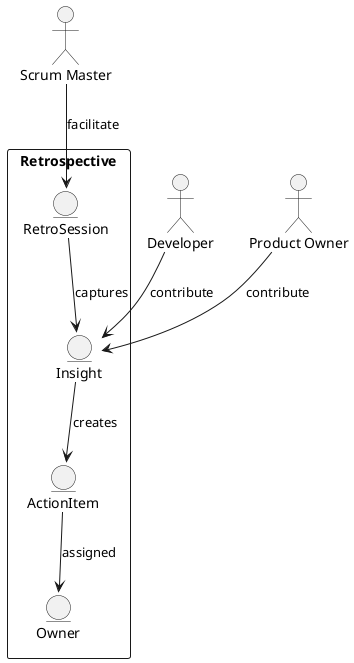

Feature 008: Retrospective Workflows

Purpose
Make retrospectives actionable by tracking insights, actions, and follow-up.

Users
- Scrum Masters
- Developers
- Product Owners

User Stories
- As a Scrum Master, I can run a retro and capture insights.
- As a team, we can turn insights into action items with owners.
- As a Scrum Master, I can track action item completion.

Acceptance Criteria
- Retro templates can be selected and customized.
- Action items have owner, due date, and status.
- Follow-up is visible in the next sprint.

Metrics
- Action item completion rate
- Repeated issues frequency

Integrations
- Optional action items sync to backlog.

Out of Scope
- Anonymous survey tooling.

Diagram

