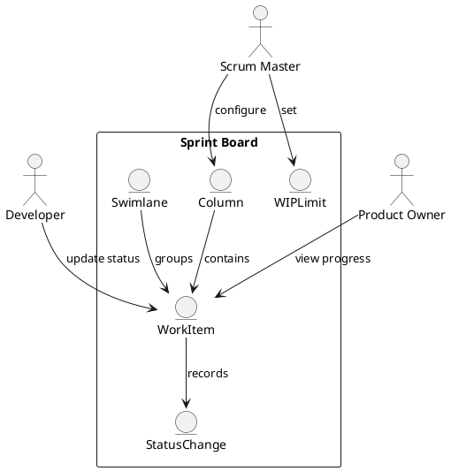

Feature 004: Sprint Board

Purpose
Provide a shared view of in-progress work with clear status, ownership,
and flow limits.

Users
- Developers
- Scrum Masters
- Product Owners

User Stories
- As a developer, I can move work across statuses.
- As a Scrum Master, I can set WIP limits per column.
- As a Product Owner, I can see progress toward sprint goals.

Acceptance Criteria
- Configurable columns with WIP limits.
- Swimlanes by epic or priority.
- Item status changes are time-stamped.

Metrics
- WIP violations
- Lead time per item

Integrations
- Optional board sync with Azure DevOps and JIRA.

Out of Scope
- Kanban-only workflows outside Scrum context.

Diagram

