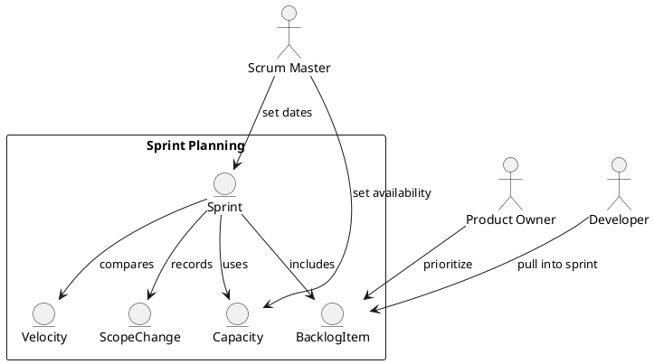

Feature 003: Sprint Planning and Capacity

Purpose
Support clear sprint commitments by balancing capacity, velocity, and
priority.

Users
- Scrum Masters
- Product Owners
- Developers

User Stories
- As a Scrum Master, I can set sprint dates and capacity.
- As a team, we can pull ready items into the sprint.
- As a Product Owner, I can see commitment vs scope changes.

Acceptance Criteria
- Sprint capacity is set by member availability.
- Planned scope shows total points vs historical velocity.
- Scope changes after start are tracked and visible.

Metrics
- Planned vs completed points
- Scope change count

Integrations
- Optional sprint metadata sync with Azure DevOps and JIRA.

Out of Scope
- Resource forecasting beyond the sprint.

Diagram

