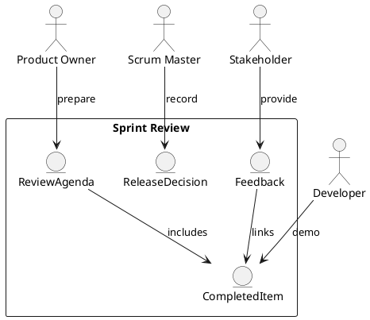

Feature 007: Sprint Review and Release Tracking

Purpose
Help teams prepare for sprint reviews and track release readiness and
outcomes.

Users
- Product Owners
- Scrum Masters
- Developers
- Stakeholders

User Stories
- As a Product Owner, I can collect completed items for review.
- As a team, we can capture review feedback and actions.
- As a Scrum Master, I can record release decisions.

Acceptance Criteria
- Review agenda and demo list can be generated from completed work.
- Feedback is captured and linked to items or new backlog entries.
- Release status is tracked per sprint.

Metrics
- Review attendance and feedback volume
- Release readiness rate

Integrations
- Optional release notes export to documentation systems.

Out of Scope
- Full product launch management.

Diagram

