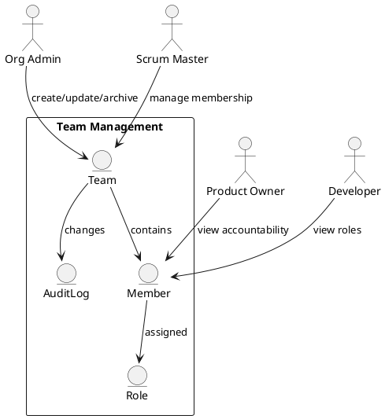

Feature 001: Team and Role Management

Purpose
Provide a clear structure for teams, roles, and responsibilities so Scrum
workflows are role-aware and consistent across the platform.

Users
- Scrum Masters
- Product Owners
- Developers
- Org admins

User Stories
- As an org admin, I can create teams and assign members to roles.
- As a Scrum Master, I can manage team membership and role changes.
- As a Product Owner, I can see who is accountable for backlog items.

Acceptance Criteria
- Teams can be created, renamed, archived, and restored.
- Members can have one or more roles per team.
- Role changes are audit logged with timestamp and actor.

Metrics
- Team count and active members by role
- Role change frequency

Integrations
- Optional sync from Azure DevOps and JIRA user directories.

Out of Scope
- HR management or payroll data.

Diagram

